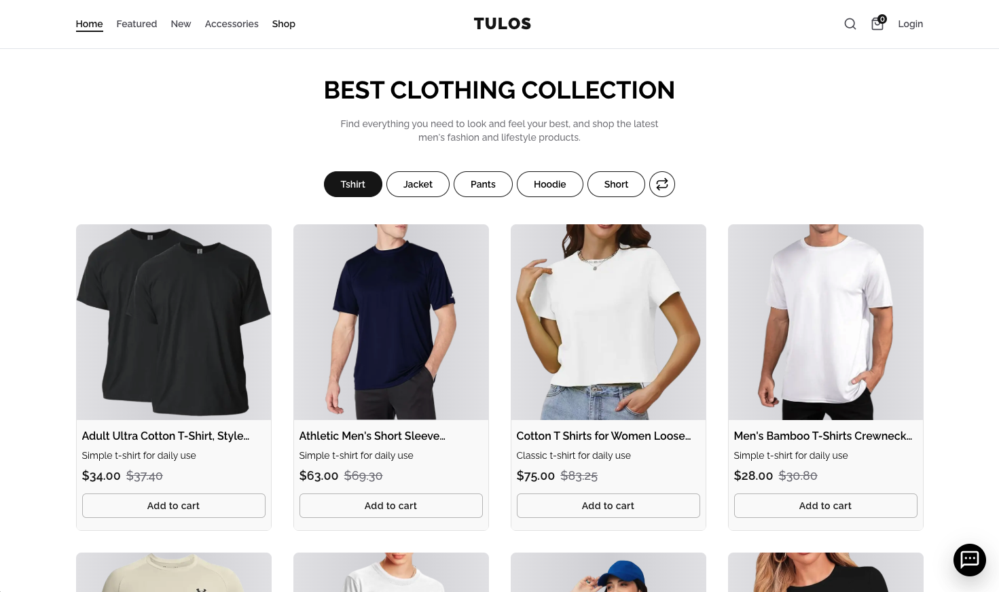

# ONIZE — Premium Next.js E-Commerce Platform



**ONIZE** is a production-ready, full-stack e-commerce storefront built with the latest web technologies. It ships with a beautiful storefront, a complete admin dashboard, Flutterwave payments, Clerk authentication, and a powerful Sanity CMS — everything you need to launch a real online store.

---

## ✨ Feature Overview

### 🛍️ Storefront

- Fully responsive design built with **Tailwind CSS v4**
- Animated hero banner, promotional banners, and deals section
- Product listing page with filters, categories, and pagination
- Individual product page with image gallery, variant selector, breadcrumbs, and related products
- Discount badges, stock indicators, and product status labels (New / Hot / Sale)

### 🔍 Search

- Instant full-text search modal with live results, skeleton loaders, and product previews
- Direct **Add to Cart** from search results

### 🛒 Cart

- Persistent cart powered by **Zustand** (survives page refreshes)
- Quantity controls, item removal, subtotal, and order summary
- Guest users can browse and add to cart; sign-in required only at checkout

### 💳 Checkout & Payments

- Streamlined **Flutterwave** checkout integration
- Manual address selection before payment
- Webhook listener automatically confirms orders post-payment (`paymentStatus: paid`)

### ❤️ Wishlist

- Add/remove products with one click from any product card or detail page
- Dedicated `/wishlist` page with a grid view and "Clear Wishlist" with confirmation dialog

### ⚖️ Compare

- Compare up to 4 products side by side in a detailed table
- Attributes: Price, Discount %, Availability (quantity), Status, Category, Variant, Product Base, Overview, Description
- Inline search to add products directly from the compare page
- Live count badge on the header compare icon
- "Clear All" with confirmation dialog

### 🔗 Share

- Slide-in share sidebar for any product
- Share to Twitter/X, Facebook, WhatsApp, LinkedIn, Reddit, Email
- One-click copy link

### 👤 Authentication

- Powered by **Clerk** — sign up, sign in, Google OAuth out of the box
- Login sidebar slides in without leaving the cart page

### 🗂️ Admin Dashboard (`/admin`)

- Protected route — only the `ADMIN_EMAIL` has access
- **Orders** — view all orders, update order status, bulk delete with confirmation
- **Users** — list all registered Clerk users, export CSV, single/bulk delete
- **Dashboard** — revenue overview, order count, user count, average order value, recent orders table

### 📦 CMS — Sanity Studio (`/studio`)

- Manage products, categories, orders, addresses, subscriptions, contact messages
- Live real-time previews with `@sanity/next-sanity`
- Seed data included (`seed.tar.gz`) to get started immediately

### 📄 Content Pages

- `/about` — animated statistics, mission, values grid, CTA
- `/faqs` — accordioned FAQ with relevant e-commerce questions
- `/terms` — Terms & Conditions with icon cards
- `/privacy` — Privacy Policy with icon cards
- `/contact` — Contact form connected to Sanity
- `/help` — Help center with FAQs and support hours

### 🎨 Design & UX

- Light & dark mode support via CSS variables
- Premium loading screen with animated rings and count-up stats on scroll
- Global toast notifications via `react-hot-toast`
- Skeleton loaders for product cards and search results
- Smooth page transitions and hover interactions

---

## 🏗️ Tech Stack

| Layer            | Technology                               |
| ---------------- | ---------------------------------------- |
| Framework        | Next.js 15 (App Router + Server Actions) |
| Styling          | Tailwind CSS v4                          |
| Animations       | Framer Motion / Motion                   |
| Authentication   | Clerk                                    |
| CMS & Database   | Sanity v3                                |
| Payments         | Flutterwave                              |
| State Management | Zustand                                  |
| UI Primitives    | shadcn/ui + Radix UI                     |
| Icons            | Lucide React                             |

---

## 🚀 Getting Started

### Step 1 — Install Dependencies

```bash
npm install
# or
pnpm install
```

### Step 2 — Set Up Environment Variables

Create a `.env` file in the project root and fill in the values below. Each service has instructions in the sections that follow.

```env
# ─── Clerk Authentication ─────────────────────────────────────
NEXT_PUBLIC_CLERK_PUBLISHABLE_KEY=pk_live_...
CLERK_SECRET_KEY=sk_live_...

# Clerk redirect URLs (keep these as-is for local dev)
NEXT_PUBLIC_CLERK_SIGN_IN_URL=/sign-in
NEXT_PUBLIC_CLERK_SIGN_UP_URL=/sign-up

# ─── Sanity CMS ────────────────────────────────────────────────
NEXT_PUBLIC_SANITY_PROJECT_ID=your_project_id
NEXT_PUBLIC_SANITY_DATASET=production
SANITY_API_TOKEN=sk...          # needs write access for orders/webhooks

# ─── Flutterwave Payments ──────────────────────────────────────
NEXT_PUBLIC_FLUTTERWAVE_PUBLIC_KEY=FLWPUBK_TEST-...
FLUTTERWAVE_SECRET_KEY=FLWSECK_TEST-...
FLUTTERWAVE_SECRET_HASH=your_webhook_hash

# ─── App ───────────────────────────────────────────────────────
NEXT_PUBLIC_BASE_URL=http://localhost:3000

# ─── Admin Access ──────────────────────────────────────────────
ADMIN_EMAIL=you@example.com     # Clerk account with this email gets /admin access
```

---

## 🔑 Credential Setup Guide

### Clerk (Authentication)

1. Go to [dashboard.clerk.com](https://dashboard.clerk.com) and create a new application.
2. Choose your sign-in methods (Email, Google, etc.).
3. Copy your **Publishable Key** → `NEXT_PUBLIC_CLERK_PUBLISHABLE_KEY`
4. Copy your **Secret Key** → `CLERK_SECRET_KEY`
5. In Clerk Dashboard → **Paths**, confirm the sign-in/sign-up URLs match your `.env`.

### Sanity (CMS)

1. Go to [sanity.io/manage](https://www.sanity.io/manage) and create a new project.
2. Copy the **Project ID** → `NEXT_PUBLIC_SANITY_PROJECT_ID`
3. Set Dataset to `production` (default).
4. Go to **API → Tokens** and create a token with **Editor** access.
   - Copy it → `SANITY_API_TOKEN`
5. Go to **API → CORS Origins** and add:
   - `http://localhost:3000` (development)
   - Your production domain (e.g. `https://yourdomain.com`)
6. **Import Seed Data** (optional but recommended):
   ```bash
   sanity dataset import ./seed.tar.gz production
   ```
   This loads sample products, categories, and orders so the store looks populated immediately.

### Flutterwave (Payments)

1. Go to [dashboard.flutterwave.com](https://dashboard.flutterwave.com) and create an account.
2. Navigate to **Settings → API**:
   - Copy **Public key** → `NEXT_PUBLIC_FLUTTERWAVE_PUBLIC_KEY`
   - Copy **Secret key** → `FLUTTERWAVE_SECRET_KEY`
3. Navigate to **Settings → Webhooks**:
   - Endpoint URL: `https://yourdomain.com/api/flutterwave-webhook`
   - Configure and copy your webhook hash → `FLUTTERWAVE_SECRET_HASH`

> **Local webhook testing with ngrok:**
>
> ```bash
> ngrok http 3000
> # Use the generated https URL as your Flutterwave webhook endpoint
> ```

---

## 📂 Project Structure

```
onize/
├── app/
│   ├── (client)/          # Public storefront routes
│   │   ├── page.tsx       # Homepage
│   │   ├── shop/          # Product listing
│   │   ├── product/[slug] # Product detail
│   │   ├── cart/          # Shopping cart
│   │   ├── compare/       # Product comparison
│   │   ├── wishlist/      # Saved products
│   │   └── (user)/        # About, FAQ, Terms, Privacy, Contact
│   ├── admin/             # Protected admin dashboard
│   │   ├── page.tsx       # Dashboard overview
│   │   ├── orders/        # Order management
│   │   └── users/         # User management
│   ├── api/
│   │   └── flutterwave-webhook/ # Flutterwave webhook handler
│   └── studio/            # Embedded Sanity Studio
├── components/            # Shared UI components
│   └── new/               # Feature-specific components
├── sanity/
│   ├── schemaTypes/       # All Sanity content schemas
│   └── helpers/           # Data fetching helpers
├── store/                 # Zustand stores
├── actions/               # Server Actions
├── seed.tar.gz            # Sanity seed data
└── .env                   # Environment variables (you create this)
```

---

## ▶️ Running the Project

```bash
# Development (with Turbopack)
npm run dev

# Production build
npm run build
npm start
```

Open [http://localhost:3000](http://localhost:3000) for the storefront.  
Open [http://localhost:3000/studio](http://localhost:3000/studio) for the Sanity CMS.  
Open [http://localhost:3000/admin](http://localhost:3000/admin) for the Admin Dashboard (requires `ADMIN_EMAIL`).

---

## 🛠️ Customisation Tips

- **Brand colours** — Edit `app/globals.css`. All colours are CSS variables (`--primary`, `--background`, etc.) so one change cascades everywhere.
- **Logo** — Update `components/new/Logo.tsx`.
- **Navigation links** — Edit `constants/index.ts` → `headerData`.
- **Hero content** — Edit `components/new/HeroCarousel.tsx` or the static hero component.
- **Products** — Add/edit products in Sanity Studio at `/studio`.
- **Admin email** — Change `ADMIN_EMAIL` in `.env` to grant dashboard access.

---

## 💬 Support

For questions, bug reports, or feature requests, please reach out via the purchase platform where you downloaded ONIZE.

**Happy building! 🚀**
